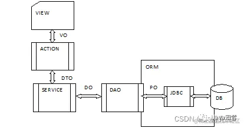

>先写思路，再写代码；思路是指导，代码是实现；一定要有一个思路去驱使你写代码，而不是边看视频边敲（还不如cv省时间）
# 1 创建项目
## 1.1 项目设计/模块划分 思路
- 从项目管理的角度来看，把模块划分成以下结构方便管理：
  1. 父工程的pom文件，主要用于控制依赖的版本，jdk版本和项目编码（parent）；
  2. 基础工程的职责是提供一些系统架构所需要的 基础类库和工具类库（base）；
  3. 其它模块继承基础模块，用来实现具体的功能（content）。
  
 

- 从功能的角度来看，功能模块可以划分成三类：
  1. 接口模块，用于前后端数据交互（落实到controller）；
  2. 业务模块，向接口模块提供数据（service和dao结合）；
  3. 数据模型模块，用于存储数据模型类、数据传输类等（后端内部和前后端交互都需要规定数据类）。
  
 

- 把上面两者结合，便可得到最终结构：
  
  

## 1.2 项目设计/模块划分 具体实现
1. 不使用骨架，新建一个Maven项目（project）；
2. 删除该项目的src文件夹——把它作为父工程；
3. 不使用骨架，在根目录中新建Maven module。
4. 为module编写pom文件：  
  

## 1.3 测试项目（走一步验证一步）
1. 创建数据库；
2. 使用idea连接数据库（连接时需要为idea单独指定数据库驱动，可以指定本地的，也可以让idea自己下载）；
3. 使用代码生成工具，如mybatisX，生成pojo类和mapper。使用idea插件生成service和controller代码。创建springboot启动类；
   - 思考这些类该放在哪个module里
4. 运行代码，打开浏览器访问后端接口。
   

# 2 统一接口和接口数据的格式

常用的几个Object：
1. VO：响应给前端的数据，controller数据返回给前端的时候，需要将DTO转成VO返回给前端
2. DTO：后端程序之间的数据传输对象，多用于service和dao之间（PO中有些属性不能暴露给前端，所以后端程序传输对象时需要过滤一些字段）；
3. PO：DAO和数据库进行数据交流的一个“接口”，由一组属性和属性的get和set方法组成。PO 中应该不包含任何对数据库的操作，PO 的属性是跟数据库表的字段一一对应的。此外 PO 对象需要实现序列化接口；
4. 响应格式：给前端的json得是固定的格式（常用key-value）。key由人为定义，比如
   -“状态码”的key一般默认为“code”
   - 具体数据的key一般为“msg”
   - 该格式的实现也是一个java类。  
   

# 3 导入swagger
## 3.1 根据文档编写controller
“按接口文档写”是啥意思？
- 请求方式是什么
- 请求路径是什么
- 返回的字段有什么讲究

## 3.2 使用swagger生成文档并进行测试
1. 导入依赖；
2. 在springboot配置文件中添加swagger的配置；