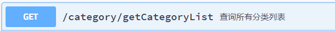

# 1 文章分类需求
页面上需要展示分类列表，用户可以点击具体的分类查看该分类下的文章列表。

接口：

要求：
1. 只展示有发布正式文章的分类  
2. 必须是正常状态的分类  

## 1.1 后端执行流程
/category/getCategoryList 请求
categoryController -> categoryService -> getCategoryList

## 1.2 相关表

